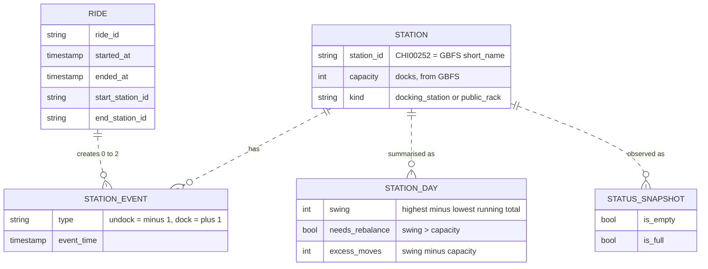
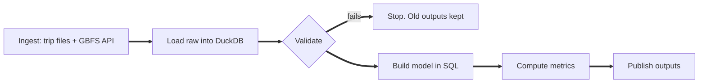

# Divvy Station Rebalancing Pipeline

FDE Data Foundations project (Track C). Chicago's Divvy bike share data, turned into a
repeatable pipeline that tells the operations team which stations break, when, and how
much truck work that needs.

## 1. Problem

Riders hit two failures: **no bike** to take, or **no dock** to return to. Divvy moves
bikes with trucks, but it has no trusted number for how often stations fail on their own,
or where the trucks should go.

**Users:** the Divvy Operations manager (main user), truck dispatch leads, and station planning.

## 2. KPI

**Rebalance-required station-day rate:** the share of days on which a docking station
could not have survived without a truck.

How we decide that: through the day we track the station's running total of
(bikes arrived minus bikes left). If the gap between the highest and lowest point
(the **swing**) is bigger than the number of docks, then no starting stock of bikes
could have kept the station working. So a truck *must* have come, or riders were turned away.

> Example: an 11-dock station loses 15 bikes by 9am and gets 15 back by 7pm.
> Its net flow is 0, so it looks fine. But its swing is 15, which is more than 11, so it needed a truck.

## 3. Results (June to August 2026, 2,499,792 rides)

| Metric | Value | What it tells ops |
|:-|:-|:-|
| **M1 (KPI)** Station-days that needed a truck | **1.64%** (stable: 1.49%, 1.78%, 1.66%) | How often the system fails on its own |
| **M2** Minimum bikes to move per day | **115** (weekends 153, weekdays 100) | Truck capacity to budget (a floor) |
| **M3** Share of that work at the top 50 stations | **93%** | A fixed route can cover almost all of it |
| **M4** Chronic stations (fail on 50% or more of days) | **6** | Candidates for more docks or a valet corral |
| **M5** Rides we can see at docks (start and end) | **61.7%** | How much of demand the KPI covers |

**What we concluded**

1. The problem is **concentrated**: 50 of 1,144 stations do 93% of the work.
2. It is mostly **stations filling up**, not running empty. 14 of the top 15 are lakefront
   leisure spots (North Ave Beach, Theater on the Lake) or Loop offices in the morning.
3. **Weekends are worse**, driven by the lakefront.
4. Live station data agrees: the chronic stations were empty or full far more often than others.

**Decision supported:** run a fixed "remove bikes" truck route over the top 50 fill stations,
weighted to weekends, before buying more general truck capacity.

Full numbers: [outputs/evidence_report.md](outputs/evidence_report.md) and the truck list
[outputs/rebalancing_targets.csv](outputs/rebalancing_targets.csv).

## 4. Sources

| Source | How we get it | One row is | Why we need it |
|:-|:-|:-|:-|
| Divvy trip history | **File:** monthly ZIP/CSV download | one ride | The only place history lives |
| GBFS station information | **API:** JSON | one station | The only place dock capacity lives |
| GBFS station status | **API:** JSON, polled every 10 min | one station at one moment | To check the model against reality |
| DuckDB warehouse | **SQL** | every layer below | All joins and metrics are SQL, so they are traceable |

## 5. Our decisions (and why)

| # | Decision | Why |
|:-|:-|:-|
| 1 | Chose station rebalancing as the problem | It is a real operational workflow with a clear owner and action |
| 2 | Used 3 recent months (Jun to Aug 2026) | Peak season, and enough to show month over month reruns |
| 3 | Joined trips to GBFS on **`short_name`**, not `station_id` | Trip ids like `CHI00252` only match `short_name`. Verified: 99.4% of dock rides match |
| 4 | KPI = **swing vs capacity**, not net flow or a fixed threshold | Net flow hides morning emptying. A fixed "10 bikes" rule is unfair to small vs big stations |
| 5 | KPI covers **docking stations only**; public racks excluded | Racks have no real capacity. Their rides still count in M5, so nothing is hidden |
| 6 | Called M2 a **lower bound** | No source has truck logs, so we can only prove the minimum moves needed |
| 7 | Day starts at **4am**, not midnight | 3am to 5am has the lowest demand, and overnight crews reset stations then |
| 8 | Identify stations by **id, never name** | 17 ids have more than one name (e.g. "North Ave Beach" and "North Avenue Beach") |
| 9 | Rides under 60s are **flagged and excluded from flow, not deleted** | Divvy says it removes them, but 63,490 remain. Most are instant re-docks |
| 10 | Assign rides to days by their **own timestamps**, not by file | Monthly files are split by ride *end* time (173 July rides sit in the August file) |
| 11 | Dropped the **last day** of each run window | Its after midnight rides are in next month's file, so it would look too calm |
| 12 | Committed GBFS snapshots to git, but not the trip ZIPs | GBFS only returns "now" and can never be fetched again. Trip ZIPs can be, so we commit their checksums |

## 6. Data model



**In words:** a ride creates an *undock* event at its start station and a *dock* event at
its end station. Adding those up in time order gives each station's running balance for the
day. Comparing the swing to capacity gives the outcome. The truck move itself (the
intervention) is not in any data, so we infer it. Live snapshots are the observed outcome.
[More detail](docs/04_data_model.md)

## 7. Pipeline



What makes it dependable:

* **Proves completeness:** file size matches the server, the ZIP passes a checksum test, CSV rows equal warehouse rows, and no day is missing.
* **Keeps raw data:** the original files are saved untouched, with a checksum list in git.
* **Never silently fixes data:** 20 rules. Each one either **stops** the run, **quarantines** the row, or **flags** it. [Rules](docs/03_validation_rules.md)
* **Safe to rerun:** unchanged files are not downloaded again, and each month is replaced, never duplicated. Two runs give identical output (tested).
* **Fails safely:** outputs are swapped in only if every step passes. A failure is logged, and the exit code is 1 (system problem) or 2 (bad data).
* **Logged:** every run has an id, a log file, and a record in `audit.runs`.
* **Tested:** 11 tests on small fake data.

## 8. Known / Unknown / Assumption / Limitation

| | |
|:-|:-|
| **Known** | All 92 days retrieved and reconciled. The KPI is about 1.6% and stable. The top 50 stations are 93% of the work. The problem is mostly dock-full |
| **Unknown** | Real truck moves (not published). Station capacity back in June. Riders who gave up at an empty station |
| **Assumption** | The day resets at 4am. Today's capacity applies to Jun to Aug. Timestamps are Chicago time |
| **Limitation** | M2 is a minimum, not the real count. 38% of rides (dockless e-bikes) are outside the KPI. The live check covers only a few hours in September |

[Full register](docs/05_known_unknowns.md)

## 9. How to run

```bash
python -m venv .venv && source .venv/bin/activate
pip install -r requirements.txt && pip install -e .
python -m divvy run      # downloads, validates, models and writes outputs/ (about 15s after download)
pytest                   # runs the tests
```

To add a new month, edit `months` in [config/pipeline.yaml](config/pipeline.yaml) and run again.

## 10. Where to find more

| File | What is in it |
|:-|:-|
| [docs/01_source_map.md](docs/01_source_map.md) | Business questions mapped to sources, owners, gaps |
| [docs/02_retrieval.md](docs/02_retrieval.md) | How we prove each download is complete |
| [docs/03_validation_rules.md](docs/03_validation_rules.md) | Data profile and all 20 rules with results |
| [docs/04_data_model.md](docs/04_data_model.md) | Workflow diagram, full data model, metric formulas |
| [docs/05_known_unknowns.md](docs/05_known_unknowns.md) | Full Known / Unknown / Assumption / Limitation list |
| [notebooks/walkthrough.ipynb](notebooks/walkthrough.ipynb) | Step by step evidence with charts |
| [src/divvy/](src/divvy/) and [sql/](sql/) | The pipeline code and model SQL |
| [flasheats-challenges/](flasheats-challenges/) | Separate: FlashEats in-class challenges for Classes 5, 6 and 7 |
