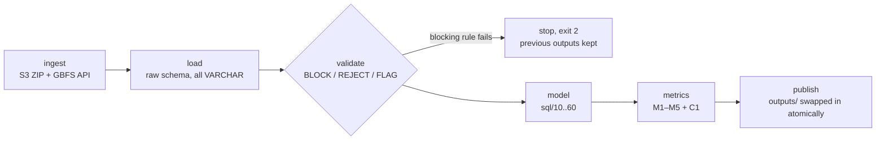

# Divvy Station Rebalancing: from client data to a dependable KPI pipeline

**FDE Data Foundations project, Track C.** Chicago's Divvy bike share, built from
two public operator systems into one repeatable pipeline that tells the operations
team **where and when stations break, how much truck work that implies, and
whether a fixed route could cover it.**

```bash
python -m divvy run        # raw inputs → validated → modelled → metrics, in about 15 seconds
```

---

## 1. Problem

Riders hit two failures: **no bike** at the start of a trip and **no dock** at the
end. Divvy moves bikes with trucks and valets, but it has no shared, trustworthy
measure of *how often stations fail by themselves* or *where the moving effort
should go*. The data exists, but it is split across a monthly trip export and a
real-time feed, and the two use different station ids.

## 2. Users and stakeholders

| Who | What they need from this |
|---|---|
| **Divvy Operations manager** (primary) | A monthly KPI, plus a ranked list of stations to put on fixed rebalancing routes |
| Field dispatch leads | For each target station: fill or drain, the worst hour, and required moves per day |
| Station planning | Chronic stations where adding docks or a valet corral beats trucking |
| Data / BI team | A reproducible, audited pipeline they can schedule monthly |

## 3. Project KPI

> **M1: Rebalance-required station-day rate.** The share of active
> docking-station-days on which the station's intraday **swing** (the peak bikes
> gained minus the deepest bikes lost since 04:00) exceeded its **dock capacity**.

On those days no starting stock level could have kept the station both
rentable and returnable, so an intervention *must* have happened, or riders
were turned away. [Why swing and not net flow →](docs/04_data_model.md#why-swing-and-not-net-flow)

Supporting metrics:

| ID | Metric | Decision it supports |
|---|---|---|
| M2 | Minimum bike moves per day (lower bound) | Truck and valet capacity to budget |
| M3 | Top-50 stations' share of required moves | Can fixed routes replace ad-hoc dispatch? |
| M4 | Chronic imbalance stations (≥ 50% of days) | Dock expansion or corral candidates |
| M5 | Dock-attributed ride coverage | How much demand the KPI can see (trust) |

## 4. Results (Jun–Aug 2026, 2,499,792 rides)

| Metric | Jun | Jul | Aug | **Window** |
|---|---:|---:|---:|---:|
| **M1** Rebalance-required station-day rate | 1.49% | 1.78% | 1.66% | **1.64%** |
| M2 Minimum bike moves per day | 114.7 | 129.4 | 100.2 | **115.0** |
| M3 Top-50 share of required moves | 97.5% | 94.9% | 92.5% | **93.2%** |
| M4 Chronic imbalance stations | 7 | 7 | 5 | **6** |
| M5 Dock-attributed ride coverage | 63.3% | 61.4% | 60.4% | **61.7%** |

Full, regenerated evidence: [`outputs/evidence_report.md`](outputs/evidence_report.md) ·
truck target list: [`outputs/rebalancing_targets.csv`](outputs/rebalancing_targets.csv)

**What this says**

1. **The problem is concentrated, so fixed routes work.** 50 of 1,144 docking
   stations (4%) account for 93% of the required moves.
2. **It is mostly a *dock-full* problem, not an *empty-station* problem.** 14 of
   the top 15 stations are *fill* stations: lakefront leisure destinations
   (North Ave Beach, Theater on the Lake, Montrose Harbor) and Loop commute
   destinations at 07:00–08:00. Trucks there should **remove** bikes.
3. **Weekends need more moves** (153/day, against 100/day on weekdays), driven by the lakefront.
4. **The model is corroborated by live data.** In GBFS snapshots, the stations
   the model calls chronic were empty or full far more often than other stations
   (see the report).
5. **About 38% of rides are invisible to any station-level KPI** (dockless e-bikes).
   This is reported, not hidden (M5).

**Decision supported:** fund a fixed "bike removal" route covering the top-50
fill stations, weighted to weekends and the lakefront, before adding general
truck capacity. Evaluate a valet corral or dock expansion at the 6 chronic
stations.

## 5. Sources

| Source | Mode | Grain | Owner |
|---|---|---|---|
| Divvy trip history (`divvy-tripdata` S3 bucket) | **File**: monthly ZIP/CSV | 1 ride | Lyft / Divvy |
| GBFS `station_information` | **API**: JSON | 1 station (capacity, `short_name`) | Lyft |
| GBFS `station_status` | **API**: JSON, polled by us | 1 station at a point in time | Lyft |
| DuckDB warehouse | **SQL** | Every layer below | This project |

Join key: trip `station_id` = GBFS **`short_name`** (not GBFS `station_id`).
Full map, ownership, and gaps: [`docs/01_source_map.md`](docs/01_source_map.md)

## 6. Pipeline



| Dependability property | How |
|---|---|
| **Completeness** | Byte count against Content-Length, a ZIP CRC test, CSV rows against warehouse rows, and no missing day ([02](docs/02_retrieval.md)) |
| **Raw preserved** | Original ZIPs and CSVs kept locally with a committed sha256 manifest; GBFS responses committed verbatim |
| **Validation** | 20 rules, each with a business reason; nothing silently fixed ([03](docs/03_validation_rules.md)) |
| **Rerun-safe** | Downloads skipped when the checksum matches; per-month delete-then-insert load; model rebuilt; identical outputs on rerun (tested) |
| **Fail closed** | Outputs are staged and swapped only on success; a failure writes `outputs/last_run.json` and `audit.runs`, and exits non-zero |
| **Logging** | A `run_id` per run, `logs/<run_id>.log`, step timings, and a rule-by-rule log |
| **Single writer** | A lock file prevents concurrent runs |
| **Tests** | `pytest`: 11 tests on synthetic data covering the swing logic, each validation outcome, reruns, and failure handling |

Exit codes: `0` success · `1` infrastructure or code error (safe to retry) ·
`2` data validation failure (investigate the input; don't just retry).

## 7. Setup and run

Requires Python 3.10+ and about 400MB of free disk for three months of raw data.

```bash
git clone git@github.com:parthdagia05/divvyRebalancingWithMyIQ.git
cd divvyRebalancingWithMyIQ
python -m venv .venv && source .venv/bin/activate
pip install -r requirements.txt && pip install -e .

python -m divvy run                              # Jun–Aug 2026 (from config/pipeline.yaml)
python -m divvy run --months 2026-07 2026-08     # any window
python -m divvy run --snapshot                   # also take a fresh GBFS snapshot
python -m divvy snapshot --count 12 --interval 600   # poll station status for 2h

pytest                                            # run the test suite
jupyter notebook notebooks/walkthrough.ipynb      # guided evidence, with charts
```

Monthly operation: add the new month to `config/pipeline.yaml` (or pass `--months`) and
rerun. Months already downloaded are verified by checksum, not downloaded again.

## 8. Repository layout

```
config/pipeline.yaml        months, source URLs, validation thresholds, metric parameters
src/divvy/
  ingest_trips.py           retrieval mode 1: S3 ZIP/CSV + completeness + manifest
  ingest_gbfs.py            retrieval mode 2: GBFS API + freshness/consistency + snapshots
  load.py                   raw → DuckDB, schema check, row reconciliation
  validate.py               staging + BLOCK/REJECT/FLAG rules → audit.validation_results
  model.py                  runs sql/*.sql + model invariants
  metrics.py                M1–M5, target list, GBFS corroboration
  report.py                 outputs/evidence_report.md
  pipeline.py               orchestration, lock, fail-closed publish, CLI
sql/                        the workflow model: station, ride, station event, station-hour, station-day, status obs
docs/                       01 source map · 02 retrieval · 03 validation · 04 data model · 05 known/unknowns · 06 demo
data/raw/trips/manifest.json    checksums of every raw input (archives themselves are gitignored)
data/snapshots/gbfs/        verbatim GBFS responses (cannot be re-fetched, so they are committed)
outputs/                    evidence from the latest successful run
notebooks/walkthrough.ipynb explanation layer over the warehouse
tests/                      synthetic-data tests
```

## 9. Known / Unknown / Assumption / Limitation (summary)

| | Most important items ([full register](docs/05_known_unknowns.md)) |
|---|---|
| **Known** | Retrieval is complete (92 of 92 days, every row reconciled). M1 is about 1.6% and stable. The top 50 stations are 93% of the work. The problem is mostly dock-full |
| **Unknown** | Actual truck and valet moves (not published). Historical capacity. Riders turned away at empty or full stations |
| **Assumption** | The day resets at 04:00. Current GBFS capacity applies to Jun–Aug. Timestamps are Chicago local time |
| **Limitation** | M2 is a **lower bound**. About 38% of rides are dockless and out of scope. GBFS corroboration comes from a few hours of polling in September, so it is directional only |

## 10. The FDE judgement call

The client's real question is about **interventions** (truck moves), but
interventions are not in any source. Rather than invent a proxy, we defined a
KPI that *proves* an intervention was required (swing > capacity) and states
plainly that it is a lower bound. We also scoped it to the stations where
capacity is meaningful, and kept the 38% we can't see as a first-class metric
rather than quietly dropping it. Demo walkthrough: [`docs/06_demo_script.md`](docs/06_demo_script.md)
