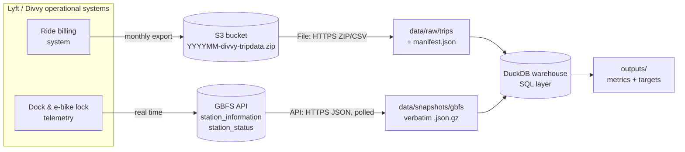

# 01 — Source Map (Class 4: Understand sources)

## The client problem

Divvy's operations team runs trucks and valets that move bikes between
stations. Riders complain about two failure modes: **no bike to take** at the
start of a trip and **no dock to return to** at the end. Leadership wants to know
*where* and *when* stations drift out of balance, how much moving is actually
required, and whether a fixed route can cover most of it.

## Business questions → information → source

| # | Business question | Information required | Source system | Field(s) |
|---|---|---|---|---|
| Q1 | Which stations lose or gain bikes through the day? | Every undock and dock event with station and time | Trip history (S3) | `start_station_id`, `started_at`, `end_station_id`, `ended_at` |
| Q2 | Is that drift more than the station can absorb? | Dock capacity per station | GBFS `station_information` | `short_name`, `capacity` |
| Q3 | How many bikes must be moved per day, at minimum? | Q1 flows aggregated per station-day, compared against Q2 | Derived (trips × GBFS) | — |
| Q4 | Is the problem concentrated enough for fixed routes? | Q3 per station, ranked | Derived | — |
| Q5 | Does the model match what riders actually see? | Empty / full docks at a point in time | GBFS `station_status` (polled) | `num_bikes_available`, `num_docks_available`, `is_renting`, `is_returning` |
| Q6 | How much of the demand can we see at all? | Share of rides that are tied to a dock | Trip history | null station ids, `rideable_type` |

## Source inventory

| Source | Retrieval mode | Owner | Grain | Refresh | History | Size used |
|---|---|---|---|---|---|---|
| Divvy trip history | **File**: ZIP → CSV over HTTPS from the public S3 bucket `divvy-tripdata` | Lyft Bikes & Scooters (the operator), published under the City of Chicago's Divvy data licence | **1 row = 1 completed ride** | Monthly, roughly 1–2 weeks after month end | Back to 2013 | 3 months (Jun–Aug 2026), about 2.6M rides |
| GBFS `station_information` | **API**: JSON over HTTPS (GBFS 2.3) | Lyft (the operator's real-time system) | **1 row = 1 station** (docking station, public rack, or corral) | `ttl` 60s | **None**, current state only | about 2,060 stations |
| GBFS `station_status` | **API**: JSON over HTTPS (GBFS 2.3) | Lyft | **1 row = 1 station at `last_reported`** | `ttl` 60s | **None**, we build our own by polling | 1 snapshot about every 10 min |
| GBFS `system_information` | **API** | Lyft | 1 row = the system | Rare | None | Used for the timezone and to sanity-check the operator |

Shown as a flow:

## Join between sources

The trip file's `start_station_id` / `end_station_id` (for example `CHI00252`)
match the GBFS `short_name` field. They do **not** match GBFS `station_id`,
which is an opaque 19-digit id. We verified this on August 2026: 1,141 of 1,574
trip station ids match a GBFS `short_name`, covering 650k of the ~679k
station-attributed departures. Nearly all of the 433 ids that don't match are
*public racks* and *corrals*. GBFS lists those without a `short_name`, and they
have no real dock capacity.

## Important gaps (recorded, not hidden)

| Gap | Effect on the analysis | How we handle it |
|---|---|---|
| **No rebalancing log is published.** Truck and valet moves never appear in the trip data. | We cannot measure interventions directly. | We compute the **minimum required** moves implied by demand (a lower bound), and state this explicitly. |
| **No historical station status.** GBFS only returns "now". | We cannot count past stockouts. | We poll snapshots ourselves and use them only to *corroborate* the model, not as the KPI. |
| **Capacity is current, trips are historical.** | A station that was expanded or removed between June and today will have the wrong capacity. | Assumption A2. Trip station ids with no GBFS match are excluded from the KPI and counted. |
| **About 30% of e-bike rides have no station.** They are parked freely or locked to a public rack. | Those undocks and docks are invisible to station balance. | We scope the KPI to docking stations and report attribution coverage as its own metric (M5). |
| **Monthly files are split by `ended_at`**, not `started_at`. | A ride that crosses midnight at month end sits in the next month's file. | We dedupe on `ride_id` across months and assign each ride to the day it *started*. |
| **Coordinates are rounded** (2 decimal places for many e-bike rides). | Rides can't be snapped to a station reliably. | We never infer a station from coordinates. |

## Ownership and contacts (who we would ask in a real engagement)

| Question | Owner we would ask |
|---|---|
| Does any rebalancing log exist? Can we get truck move records? | Divvy Operations / Lyft Field Ops |
| When and why are capacities changed? Is there a station change history? | Lyft Station Planning |
| Why do some e-bike rides have a station and others don't? | Lyft Data / Product (lock-to vs. free-float rules) |
| Is the published data filtered (staff rides, test docks, rides under 60s)? | City of Chicago CDOT data liaison / Lyft Data |
