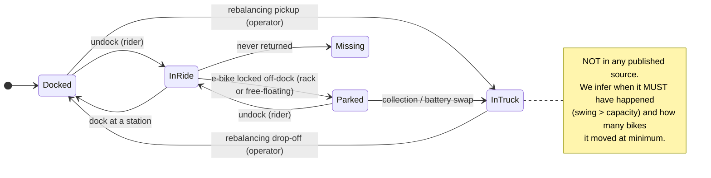
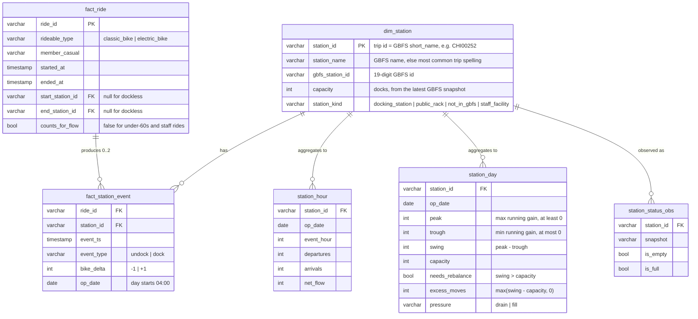

# 04 — Workflow & Data Model (Class 7)

## The operational workflow

A bike's life at a station, and where the operator steps in:



What we can observe, and from which source:

| Workflow element | Type | Observed in | Table |
|---|---|---|---|
| Station | Entity | GBFS `station_information` + trip station ids | `model.dim_station` |
| Ride | Interaction | Trip history | `model.fact_ride` |
| Undock / dock | Event | Derived from each ride's start and end | `model.fact_station_event` |
| Station running balance | State | Derived: running sum of events since 04:00 | `model.station_day` (peak, trough, swing) |
| Rebalancing move | Intervention | **Not observed**; inferred as a lower bound | `model.station_day.excess_moves` |
| Station empty / full | Outcome | GBFS `station_status` (our own polling) | `model.station_status_obs` |

## Relational model



Layers in the DuckDB warehouse:

| Schema | Built by | Contents |
|---|---|---|
| `raw` | `load.py` | Source rows verbatim (all VARCHAR) with lineage columns |
| `staging` | `validate.py` | Typed rows with flag columns; `trips_rejected` quarantine |
| `model` | `sql/10..60_*.sql` | The entities, events, and outcomes above |
| `metrics` | `metrics.py` | Station summary and metric tables |
| `audit` | `validate.py`, `pipeline.py` | Validation results and run history per `run_id` |

## Why swing and not net flow

Net flow (arrivals minus departures over the whole day) hides the problem. A
station that loses 15 bikes by 9am and gets 15 back by 7pm has a net flow of
**0**, yet with 11 docks it was empty for part of the morning. Swing captures
exactly this:

```
running gain   0 ─┐                         ┌─ 0      peak   = 0
                  └──┐                  ┌───┘         trough = -15
                     └─────── -15 ──────┘             swing  = 15 > capacity 11
      04:00        09:00              19:00           → needs_rebalance, excess_moves = 4
```

To stay usable, a station starting with *s* bikes needs *s ≥ −trough* (enough
bikes for the deepest loss) and *s + peak ≤ capacity* (enough docks for the
biggest gain). Both can hold only if *swing ≤ capacity*.

## Metrics linked to the KPI

| ID | Metric | Formula | Decision it supports |
|---|---|---|---|
| **M1 (KPI)** | Rebalance-required station-day rate | `avg(needs_rebalance)` over active docking-station-days | Is the system getting better or worse, month over month? |
| M2 | Minimum bike moves per day | `sum(excess_moves) / operational days` | Truck and valet capacity to plan (a floor, not a ceiling) |
| M3 | Top-50 share of required moves | Share of `excess_moves` at the 50 highest stations | Can a fixed route replace ad-hoc dispatch? |
| M4 | Chronic imbalance stations | Stations with `needs_rebalance` on ≥ 50% of active days (min 10 days) | Candidates for fixed routes, valet corrals, or dock expansion |
| M5 | Dock-attributed ride coverage | Share of rides that start **and** end at a docking station | How much of demand M1–M4 can see; a trust metric |

Corroboration (C1): stations that M4 calls chronic should appear empty or full
in live GBFS snapshots more often than other stations.
